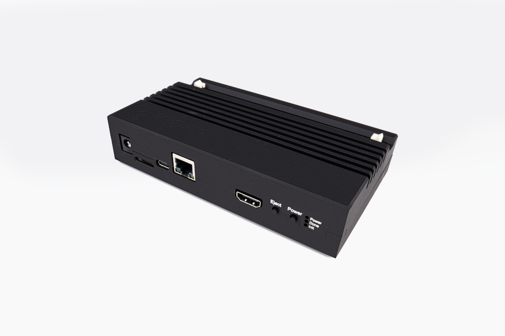

# Data Center DDR4 Tester Enclosure

Copyright (c) 2022-2023 [Antmicro](https://antmicro.com)

## Overview

This repository contains open hardware mechanical design files for an enclosure matching the [Data Center DRAM Tester](https://github.com/antmicro/data-center-dram-tester) PCBs.
The enclosure has been optimized mechanically for PCBs in revision 1.2.0.
There are three major parts of the enclosure:

* bottom tray,
* top lid (installed above the FPGA, connectors and power supply section of the PCB),
* DRAM frame (installed around the DDR4 RDIMM module slot).

## Repository structure

The main repository directory contains a LICENSE and a README.
The remaining files are stored in the following directories:

* `step` - contains the enclosure parts published as STEP files 
* `stl` - contains the enclosure parts for 3D printing in STL format
* `dxf` - contains the production file for PMMA laser cutting
* `img` - contains graphics for this README

## Key features

* Dust protection
* Improves passive cooling of the FPGA 
* Optimized for desktop usage

## License

[Apache-2.0](LICENSE)
